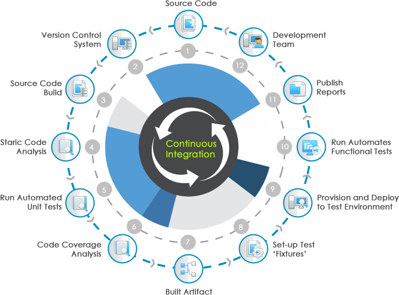
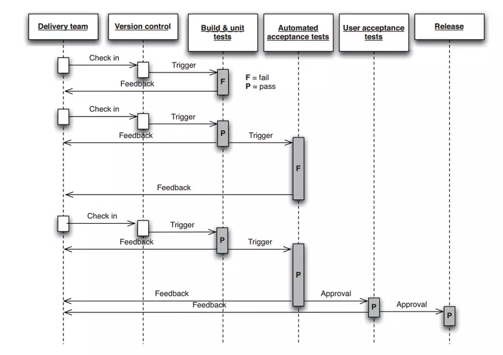

# CI- CD

## I, Tổng quan về Continious Intergration (CI)

+ CI là quy trình phát triển phần mềm trong đó các nhà phát triển tích hợp code mới mà họ cập nhật thường xuyên.
+ Thử nghiệm tự động sẽ được chạy tự động sau mỗi lần build
+ Việc này giúp chúng ta dễ dàng khắc phục lỗi sau mỗi lần build project hợp lý hóa quy trình xây dựng phần mềm
+ CI là phần từ commit code đến deploy bao gồm run các xem code có thể build thành công và chạy các unit test, integertion test,....

## Quy trình một kịch bản CI
+ Đầu tiên, developer sẽ commit code lên repo(github)
+ CI server kiểm tra xem liệu có thay đổi nào trên repo hay không
+ Ngay sau khi commit xảy ra, CI server phát hiện thay đổi và build code và chạy các unit test, integration test,...
+ CI server sinh ra các feed back gưi các member trong project
+ CI server tiếp tục đợi các thay đổi từ repo

==> Tóm lại CI là quy trình build và test tự động

## Lợi ích của CI (tích hợp liên tục)
+ Dễ  dàng quản lý code hơn
+ Tiết kiệm thời gian release phần mềm mới
+ Cải thiện khả năng tích hợp hệ thống, giúp giảm bớt những rủi ro trong vòng đời phát triển phần mềm

## II, Tổng quan về Continuous Delivery (CD)
+ Continuous Delivery là chuyển giao liên tục bằng cách triển khai thay đổi về code đến môi trườn stragging hoặc testing (thử nghiệm)
+ Là phần công việc tự động hóa các công việc sau phần CI cho các đến lúc đưa các ứng dụng tới người dùng, bao gồm công việc deploy code lên server và run các loại test UI test, API test, ...

### Quy trình chạy của CD

Tương đối giống với khái niệm  Continous Deployment. Hai khái niệm này thường bị nhầm lẫn với nhau.
Continous Deployment là kỹ thuật deploy tự động lên môi trường production, còn Continuous Delivery deploy thủ công lên môi trường production

Về cơ bản môi trường staging cũng giống môi trường productiton. Tuy nhiên không nên chạy thẳng lên production nhằm kiểm soát rủi ro tốt hơn.

Dù Continous Deployment có thể  không phù hợp với mọi công ty, nhưng  Continuous Delivery phù hợp với mọi yêu cầu công ty vì tuân thủ triết lý của Devops